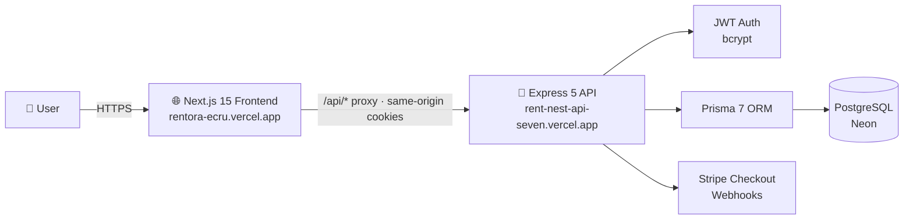

<div align="center">

# 🏠 RentNest

### A full-stack rental property marketplace for Bangladesh

Browse **verified listings**, submit **rental requests**, and manage **approvals & payments** — all from one seamless platform.

<br/>


<br/>


<br/>

[](https://rentora-ecru.vercel.app)
[](https://rent-nest-api-seven.vercel.app)
[](https://github.com/Imtius10/Rentora)

</div>

---

## 🌟 Highlights

| 🎯 Role | 🗝️ What you can do |
|:--------|:-------------------|
| **Tenant** 🏃 | Browse & search listings, submit rental requests, pay via **Stripe**, rate your rental |
| **Landlord** 🗝️ | Publish & manage listings, approve or reject tenants, track rent & reviews |
| **Admin** 🛡️ | Oversee all users, listings & requests — ban/unban and reassign roles |

### 🔐 Demo accounts

| Role      | Email                     | Password  |
|:----------|:--------------------------|:----------|
| 👑 Admin   | `admin@rentnest.com`      | `admin123`|
| 🗝️ Landlord | `imtius1@example.com`     | `12345678`|
| 🏃 Tenant   | `tanvir@tenant.com`       | `123456`  |

---

## 🗺️ Features

### 🏘️ For everyone
- 🔍 Search & filter listings by **location**, **price range** and **property type** (apartment · studio · house · condo · penthouse · villa · more)
- 🖼️ Rich property detail pages with category visuals & landlord info
- 🎠 Auto-scrolling category explorer & testimonial carousel
- ⚡ Blazing-fast UI with **TanStack Query** caching

### 👤 Tenants
- 📝 Register & log in with JWT **access + refresh** tokens (httpOnly cookies)
- 📨 Submit rental requests straight to landlords
- 💳 **Secure Stripe Checkout** once approved
- 🧾 Payment history with live status tracking
- ⭐ Leave reviews after a completed rental

### 🗝️ Landlords
- 📈 Clean dashboard with stats, listings & rental overview
- ➕ Create, edit, archive & delete listings
- ✅ Approve or reject tenant requests in one click
- 👥 See every renter and their history

### 🛡️ Admins
- 📊 Platform-wide analytics: users, properties & requests breakdown
- 🚫 Ban/unban users & change their roles
- 🔎 Watch every listing, request and payment

---

## 🧱 Architecture



| Layer      | Technology |
|:-----------|:-----------|
| **Frontend** | Next.js 15 (App Router), React 19, Tailwind CSS 4, **shadcn/ui**, TanStack Query |
| **Backend**  | Node.js, Express 5, TypeScript 7 |
| **Data**     | Prisma 7 (PrismaPg adapter) · PostgreSQL (Neon) |
| **Auth**     | JWT (access + refresh) · bcrypt · httpOnly cookies |
| **Payments** | Stripe Checkout |
| **Deploy**   | Vercel (frontend + serverless backend) |

---

## 📁 Repository layout

```
Rentora/
├── Module_4_Frontend/            # Next.js 15 frontend (shadcn/ui)
│   ├── app/                      # App Router pages & routes
│   │   ├── properties/           #   browse · filters · detail
│   │   ├── dashboard/            #   role-based dashboards
│   │   ├── login | register/     #   authentication
│   │   └── payment/              #   Stripe success/cancel
│   ├── components/
│   │   ├── shadcn/               #   official shadcn/ui (accordion, carousel…)
│   │   ├── ui/                   #   app UI kit (button, card, badge…)
│   │   ├── layout/               #   navbar & footer
│   │   └── properties/           #   cards, icons, filters
│   ├── hooks/                    # TanStack Query hooks + auth context
│   ├── lib/                      # API client, constants, helpers
│   ├── middleware.ts             # route protection
│   └── next.config.ts            # /api/* rewrite proxy →
└── Module_4/                     # Express + Prisma backend
    ├── src/                      # routes · controllers · services
    ├── prisma/                   # schema · migrations · seed
    └── api/                      # Vercel serverless entry
```

---

## 🚀 Getting started

### 1️⃣ Frontend

```bash
cd Module_4_Frontend
npm install
cp .env.example .env.local      # set NEXT_PUBLIC_API_URL
npm run dev                     # http://localhost:3000
```

> `.env.local` — the API is proxied via Next rewrites so auth cookies stay same-origin:
> ```env
> NEXT_PUBLIC_API_URL=https://rent-nest-api-seven.vercel.app
> ```

### 2️⃣ Backend

```bash
cd Module_4
npm install
npx prisma generate
npx prisma db push              # or: npx prisma migrate dev
npm run seed                    # demo users + properties
npm run dev                     # http://localhost:5000
```

### 3️⃣ Stripe webhooks (local)

```bash
stripe listen --events checkout.session.completed \
  --forward-to localhost:5000/api/payments/webhook
```

---

## 🔄 How it works

```
  ①  Create an account      →  Tenants & landlords sign up (or use a demo account)
  ②  Apply or list          →  Tenants request rentals · landlords publish properties
  ③  Get approved & pay     →  Landlords approve · tenants pay securely via Stripe
  ④  Move in & review       →  Rate the rental and leave a review for others
```

---

<div align="center">

Built with ❤️ using **Next.js · Express · Prisma · Stripe**<br/>
UI powered by **[shadcn/ui](https://ui.shadcn.com)** · Deployed on **[Vercel](https://vercel.com)**

</div>